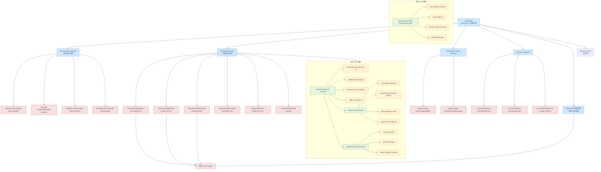
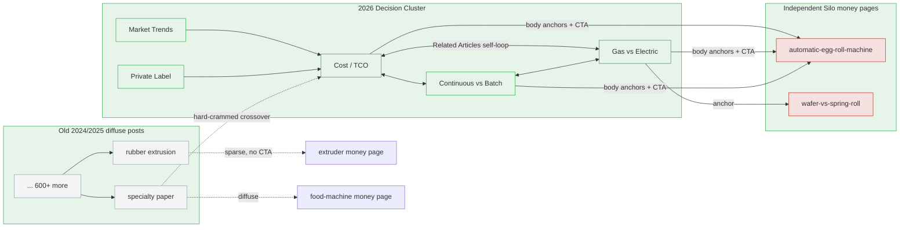
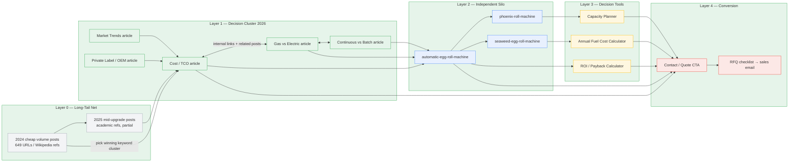

# UD Machine Site Architecture Reverse Engineering v2

> Capture date: 2026-07-27
> Evidence: `evidence-register.md`

## Observed Sitemap Distribution

The current public sitemap set contains `745` URLs:

| Directory | URL Count | Meaning |
|---|---:|---|
| `/blog/` | 649 | Long-tail coverage engine |
| `/cnc-machine/` | 27 | Product line |
| `/extruder-machine/` | 15 | Core B2B money pages |
| `/food-machine/` | 13 | Core B2B money pages |
| `/calculators/` | 11 | Generic calculator directory; mixed quality |
| `/paper-making-machine/` | 10 | Product line |
| `/automatic-egg-roll-machine/` | 5 | Independent product silo |
| `/phoenix-roll-machine/` | 5 | Independent sub-product silo |
| `/seaweed-egg-roll-machine/` | 4 | Independent sub-product silo |
| other | 6 | Home, About, Contact, privacy, success, locations.kml |

The old `~737` count is historical and must not be reused without a capture date.

## Architecture Insight

UD Machine is not a normal company site.

```text
Normal company site:
Homepage + Products + About + Contact

UD Machine model:
Homepage
  + product hubs
  + product money pages
  + independent product silos
  + blog knowledge base
  + FAQ database
  + product-specific calculators
  + trust pages
  + multi-language versions
```

This structure may support informational, commercial, decision, and transactional queries. That is an inference, not a proven traffic attribution.

## Traffic Structure Diagram (mermaid)



`classDef` legend: blue = hub/pillar, green = independent silo money page, yellow = decision tool, red = money page / conversion target.

## Blog Content Strategy (three generations)

Sampling 6 posts (2026-07-27 / 2026-08-05) shows UD Machine's blog is not a flat long-tail dump — it is a quality upgrade curve across three generations:

```text
2024 generation (cheap volume)
  - Wikipedia-only references
  - leaked AI persona / hallucination residue in body text
  - fills long-tail surface area, low cost per post

2025 generation (mid upgrade)
  - academic references (Semantic Scholar papers)
  - type tables and case-study sections
  - still carries hallucination residue ("behavioral chauvinism", "Rao circa")
  - transitional quality, applied to secondary clusters

2026 generation (decision content cluster)
  - verifiable primary sources (eCFR, OSHA, ISO, EUR-Lex, USPTO, EIA, BLS, peer-reviewed journals)
  - original worked math (cost per 1,000 sellable rolls, TCO, crossover matrix)
  - decision frameworks (SKU-Count Fit Line, facility readiness checklist, RFQ checklist)
  - transparency/disclosure blocks + "Reviewed by technical team"
  - named authors, cluster cadence, money-page + sibling internal links
  - CTA + FAQPage JSON-LD + References on every post
```

Observable strategy: build the 649-post surface first, then progressively re-cut the highest-value clusters into citable decision content that feeds the independent silos. The egg-roll cluster is the first fully-upgraded pilot; 2025-grade paper/rubber posts show the same upgrade applied partially to secondary clusters. The 2026 cluster is engineered for AI-search citation (GEO) as well as Google. Attribution to actual traffic remains inference until GSC/Ahrefs is available.

### What NOT to copy (不要学的垃圾)

Do not replicate the low-quality generations. They are observed negative patterns, not growth recipes:

- **AI hallucination residue**: leaked AI personas in body text ("As a Human Resource Manager…"), nonsense phrases ("behavioral chauvinism", "Rao circa", "virkokurku process"). Zero editorial review.
- **Wikipedia-only sourcing**: references list of 3 generic Wikipedia links masquerading as research.
- **Content that pads with fluff**: generic encyclopedic sections, invented statistics with no traceable source, tables that add no decision value.
- **Keyword-stuffed unrelated links**: a paper-machine post linking to a kurkure post purely to pass link juice.
- **The `/calculators/` noise directory**: mortgage, puppy-weight, creatinine, sig-fig calculators unrelated to machinery.

Copy only the 2026 decision-cluster layer (verified sources, original math, decision frameworks, transparency, cluster cadence). If a post cannot support a claim with a real source and real calculation, it does not ship.

## Link Equity Flow (权重流, mermaid)

Where the blogs actually send link equity — extracted from HTML, no SEO tool needed.



Reading the diagram:
- **Thick green → red**: 2026 cluster sends dense, directed equity into the egg-roll silo money page (+ one silo-internal comparison page). This is the revenue path.
- **Grey diffuse web**: 2024/2025 posts leak equity blog-to-blog, with only occasional sparse anchors to money pages and one hard-crammed cross-topic link. This adds noise, not authority concentration.

Takeaway: the leaky mass of old posts is not what builds rankings. The 5-7 dense 2026 decision posts centered on one silo do. Replicate that concentration, not the volume.

## Traffic Play (流量打法, mermaid)

How the blog + silo + tool system converts search demand into leads:



Flow logic: Layer 0 floods long-tail surface → data (or SERP pressure) reveals which keyword cluster converts → Layer 1 re-cuts that cluster into GEO-citable decision articles → internal links push authority into the Layer 2 independent silo → silo routes buyers into Layer 3 calculators (utility / AI-citation bait) → all layers converge on the Layer 4 quote/contact funnel. This is the play to replicate: don't just publish — pick a cluster, re-cut it into decision content, and funnel through a dedicated silo.

## Copyable Architecture

```text
Homepage
  Product Category Hub
    Product Money Page
      Multi-Series Spec Tables
      Process Flow
      FAQ
      Related Products
      Related Blog Posts
    Independent Product Silo (only when justified)
      Dedicated Money Page
      3-5 Product-Specific Calculators
      1-2 Comparison Pages
      Independent Blog Category
      FAQ Hub
  Blog Knowledge Base
    Buying Guide
    Cost Guide (independent article)
    How It Works
    Process Guide
    Comparison
    Troubleshooting
    Standards / Certification
  Product-Specific Tools
    ROI Calculator
    Capacity Planner
    Model Selector
    Installation Fit Checker
    Fuel / Labour Cost Calculator
  Trust Pages
    About
    Contact
    Factory
    Certifications
    Case Studies
  Multi-Language Versions
```

## Independent Product Silo Upgrade Pattern

This is the most important v2 discovery.

```text
/food-machine/kurkure-production-line/
  normal product money page

/automatic-egg-roll-machine/
  independent money page
  /wafer-egg-roll-production-roi/
  /model-decision-helper/
  /annual-fuel-cost-calculator/
  /wafer-vs-spring-roll/

/phoenix-roll-machine/
  independent sub-product money page
  /roi-payback-calculator/
  /phoenix-roll-capacity-annual-output-planner/
  /plant-readiness-check/
  /phoenix-roll-vs-egg-roll-machine/

/seaweed-egg-roll-machine/
  independent sub-product money page
  /capacity-planner/
  /install-fit-checker/
  /labour-savings-calculator/
```

Observed conditions for an independent silo:

- Independent top-level URL.
- Dedicated model line: UD05-2, UD05-3, UD-02, or UD-HT.
- Dedicated engineering narrative, such as wafer-versus-spring-roll distinction or rotary-station workflow.
- Dedicated calculator and comparison pages.
- Dedicated blog category.

Reusable decision rule:

```text
Upgrade a sub-category only when it has:
1. commercial demand;
2. an independent product/specification system;
3. a meaningful technical distinction;
4. enough evidence to support the page set;
5. at least one useful decision tool.
```

Do not create a silo solely because a keyword exists. Validate SERP intent, business value, content evidence, and maintenance capacity first.

## Page Type Roles

### Homepage

Role:

```text
brand trust + broad category explanation + authority distribution
```

The homepage should distribute users and internal authority to product hubs, money pages, and important independent silos.

### Product Category Hub

Examples:

```text
/food-machine/
/extruder-machine/
/paper-making-machine/
/cnc-machine/
```

Role:

```text
rank for category-level terms
explain product line
link to detailed products
act as topic silo root
```

### Product Money Page

Examples:

```text
/food-machine/kurkure-production-line/
/extruder-machine/twin-screw-extruder/
```

Observed modules:

```text
H1
above-fold buyer promise
CTA
product solution overview
model/product cards
multi-series specification tables
process flow
applications
factory/trust evidence
related products
supporting blogs
FAQ
contact form
BreadcrumbList JSON-LD
FAQPage microdata
```

Important correction: the sampled money pages do not contain a clear price section. Price intent is primarily handled by independent blog articles.

### Blog Page

Role:

```text
capture long-tail queries
educate buyers
feed internal links to money pages and tools
build topical authority
```

Observed template:

```text
Title
TOC
date/author
featured image
H2/H3 question structure
contextual product links
reference sources
FAQ
related posts
main products
contact CTA
Organization/WebSite/WebPage/NewsArticle/Person/ImageObject/BreadcrumbList schema
separate FAQPage JSON-LD on sampled article
```

### Product-Specific Calculator Page

Role:

```text
capture decision intent
turn product facts into personalized outputs
create a link-worthy utility
bridge user to quote or product page
candidate for AI retrieval/citation measurement
```

Copyable types:

```text
ROI / payback calculator
capacity planner
model decision helper
installation fit checker
annual fuel cost calculator
labour savings calculator
thickness/spec selector
```

Place calculators under the relevant product silo:

```text
/{product-silo}/{calculator-slug}/
```

Do not treat calculator existence as proof of AI visibility. Measure mention, citation, cited URL, and accuracy across repeated prompts.

### Generic Calculator Directory

The current `/calculators/` directory includes unrelated tools such as mortgage payoff, puppy weight, creatinine clearance, sig-fig, and slope-intercept calculators. These are noise or risk, not a B2B machinery growth pattern.

## Multi-Language Architecture

The sampled page exposes 16 hreflang alternates:

```text
en, ar, nl, fr, de, it, ja, ko, ms, fa, pt, ro, ru, es, tr, zh-TW
```

Observed URL pattern:

```text
/{lang}/{original-path}/
```

For a new project, only implement a language branch when translated content, editorial ownership, canonical rules, hreflang reciprocity, and market demand are available. Do not create thin machine-translated doorway pages.

## Schema Pattern

Observed implementation differs by page type:

```text
Money page:
  BreadcrumbList JSON-LD
  FAQPage microdata

Blog page:
  Organization/Corporation
  WebSite
  ImageObject
  BreadcrumbList
  WebPage
  Person
  NewsArticle
  separate FAQPage JSON-LD
```

Schema describes page/entity relationships; it does not guarantee rankings or AI citations.

## Clean Topic Silo Model

When applying this to a new project, use cleaner silos than the observed site:

```text
Silo 1: Product
Silo 2: Independent Product Sub-Silo
Silo 3: Application
Silo 4: Buyer Decision
Silo 5: Technical Knowledge
Silo 6: Cost / ROI
Silo 7: Standards / Compliance
Silo 8: Case Studies
Silo 9: Multi-Language Versions
```

Every silo must route internal links back to relevant money pages or decision tools.
